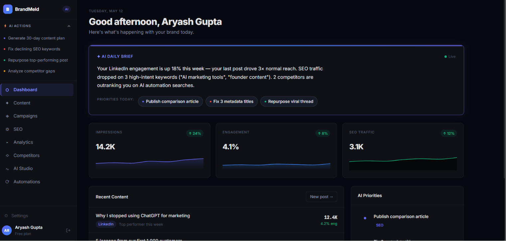

<div align="center">
  
</div>

# BrandMeld — The Distribution Engine for Founders

> **"Distribution is the #1 startup killer. Better product loses to better distribution, every single time."**

BrandMeld is not an AI writing tool — it's a **systematic distribution engine** for founders and product owners. Every week, it turns your raw product updates, milestones, and insights into a coordinated multi-channel distribution event — LinkedIn, X, and newsletter — in your authentic brand voice. Founders who distribute consistently win. BrandMeld is the system.

<div align="center">
  
</div>

---

## 🔁 The Distribution Flywheel

```
Signal → Draft → Refine → Distribute → Measure
  ↑                                         │
  └─────────────── (weekly loop) ───────────┘
```

| Step | Section | Route | What it does |
|---|---|---|---|
| ⚡ | **Signal** | `/discover` | Pick what happened this week worth distributing |
| ✦ | **Draft** | `/plan` | AI generates your distribution — streams word-by-word |
| ✏ | **Refine** | `/create` | Edit, tone-adjust, perfect before sending |
| 📡 | **Distribute** | `/publish` | One click → LinkedIn + X + Newsletter simultaneously |
| 📊 | **Measure** | `/learn` | What reached people? Analytics feed back into next week |

---

## 🚀 What's New (Distribution Engine v2)

### ⚡ Real-Time Streaming Generation
Content now types out word-by-word as it's generated, like ChatGPT. Signal metadata (hook, audience, tone) appears the moment extraction completes, so you're never staring at a blank screen. Powered by NVIDIA NIM SSE streaming with graceful non-streaming fallback.

### 📡 One-Click Multi-Channel Distribution
After your post is generated, click **"⚡ Distribute Now"** to fire a modal showing all your connected channels (LinkedIn, X, Newsletter, Instagram coming soon). Check the channels you want, click once — BrandMeld pushes to all of them simultaneously with live per-channel status feedback.

### 📊 Distribution Stats Strip
The Signal page now shows your weekly distribution dashboard at a glance: posts this week, current streak, total distributed, and which channels you've used. Keeps you accountable and coming back weekly.

### 🔐 Security Fixes (P0)
- **BUG-2 fixed**: `user_id` removed from all request bodies — always derived server-side from JWT
- **BUG-3 fixed**: Brand voice override now persists to Supabase, not `localStorage` (was lost on every page reload)
- **Router fixed**: `/settings` now correctly routes to the full Settings Hub with all 4 tabs active

### 🎨 Settings Hub — 4 Live Tabs
| Tab | What's inside |
|---|---|
| **Brand DNA** | URL scanner + editable voice override → saved to Supabase |
| **Connected Channels** | LinkedIn OAuth (live), X (web intent), Instagram (coming soon) |
| **Voice Marketplace** | Fork a top founder's voice profile |
| **Account** | Profile, plan, sign out |

---

## 🏗️ Architecture

```
BrandMeld-CloudRunHackathon/
├── backend/                      # Python FastAPI (Cloud Run)
│   ├── app/
│   │   ├── core/
│   │   │   ├── llm.py            # NVIDIA NIM client factory + retry helper
│   │   │   └── config.py         # Environment configuration
│   │   ├── routers/
│   │   │   ├── autopilot.py      # POST /engine/autopilot + SSE /stream + GET /analytics/summary
│   │   │   ├── publishing.py     # POST /publish/post — LinkedIn OAuth + X web intent
│   │   │   └── ...               # campaign, analytics, marketplace, prompts
│   │   ├── services/
│   │   │   ├── engine.py         # Brand DNA scraping (Playwright + NVIDIA vision)
│   │   │   ├── voice_service.py  # Authenticity scoring
│   │   │   └── publishing_service.py  # Token encryption + platform dispatch
│   │   └── main.py
│   ├── database/schema.sql       # Full Supabase schema (RLS, oauth_state table)
│   └── requirements.txt
└── frontend/                     # React + Vite + TypeScript
    └── src/
        ├── components/
        │   ├── DistributionStats.tsx   # Weekly stats strip (Signal page)
        │   └── DistributeModal.tsx     # Multi-channel distribute modal
        ├── hooks/
        │   └── useConnectedAccounts.ts # Social connection state management
        ├── layout/
        │   └── Sidebar.tsx             # Distribution Engine nav (Signal/Draft/Refine/Distribute/Measure)
        ├── pages/
        │   ├── DashboardPage.tsx       # SSE streaming generation + DistributeModal
        │   ├── DiscoverPage.tsx        # Signal cards + DistributionStats strip
        │   ├── SettingsPageNew.tsx     # Settings hub (Brand/Connections/Marketplace/Account)
        │   └── PublishPage.tsx         # Connected accounts + publish history
        └── services/
            └── apiService.ts           # Social connection CRUD + publishing methods
```

---

## 📡 API Reference

All endpoints require `Authorization: Bearer <supabase_jwt>` (user_id always derived from JWT, never from request body).

### Autopilot Engine
| Method | Path | Description |
|---|---|---|
| `POST` | `/v1/engine/autopilot` | Generate post from signal (non-streaming) |
| `POST` | `/v1/engine/autopilot/stream` | Generate post as SSE stream (word-by-word) |
| `GET` | `/v1/engine/analytics/summary` | Distribution stats for current user |

### Campaign & Brand DNA
| Method | Path | Description |
|---|---|---|
| `POST` | `/v1/campaign/onboard` | Scrape URL → extract Brand DNA → store in Supabase |
| `POST` | `/v1/campaign/launch` | Batch generation for X + LinkedIn + Instagram |
| `POST` | `/v1/campaign/edit` | AI-directed draft revision |
| `GET` | `/v1/campaign/watchdog` | Poll for new products on a URL |

### Publishing & OAuth
| Method | Path | Description |
|---|---|---|
| `POST` | `/v1/publish/post` | Publish to connected platforms |
| `GET` | `/v1/connect/linkedin` | Generate LinkedIn OAuth URL |
| `GET` | `/v1/connect/linkedin/callback` | Handle LinkedIn OAuth callback |
| `GET` | `/v1/publishing/connected` | List connected social accounts |

### Onboarding & Status
| Method | Path | Description |
|---|---|---|
| `GET` | `/v1/onboarding/status` | Check if user has Brand DNA + connected accounts |

---

## 🛠️ Local Setup

### Prerequisites
- Python 3.11+, Node.js 18+
- Supabase account (auth + database)
- NVIDIA NIM API key (generate at [build.nvidia.com](https://build.nvidia.com))

### Environment Variables

**`backend/.env`**
```env
# NVIDIA NIM (required for all AI features)
NVIDIA_API_KEY=nvapi-...
NVIDIA_MODEL_ID=nvidia/llama-3.1-nemotron-70b-instruct

# Supabase
SUPABASE_URL=https://your-project.supabase.co
SUPABASE_SERVICE_ROLE_KEY=your_service_role_key
JWT_SECRET=your_supabase_jwt_secret

# LinkedIn OAuth
LINKEDIN_CLIENT_ID=your_linkedin_client_id
LINKEDIN_CLIENT_SECRET=your_linkedin_client_secret
LINKEDIN_REDIRECT_URI=http://localhost:8080/v1/connect/linkedin/callback

# Token encryption (generate: python -c "from cryptography.fernet import Fernet; print(Fernet.generate_key().decode())")
FERNET_KEY=your_fernet_key

PORT=8080
```

**`frontend/.env.local`**
```env
VITE_API_URL=http://localhost:8080
VITE_SUPABASE_URL=https://your-project.supabase.co
VITE_SUPABASE_ANON_KEY=your_anon_key
```

### Database Setup

Run [schema.sql](./backend/database/schema.sql) in your Supabase SQL editor. Includes:
- `brand_dna` — extracted brand voice per user
- `autopilot_drafts` — all generated posts with signal metadata
- `published_posts` — distribution history per channel
- `social_connections` — encrypted OAuth tokens
- `oauth_state` — HMAC-signed state tokens for secure OAuth flow
- Row-Level Security policies on all user tables

### Run Locally

```bash
# Backend
cd backend
python -m venv .venv
.venv\Scripts\activate       # Windows
pip install -r requirements.txt
python -m uvicorn app.main:app --reload --port 8080

# Frontend (new terminal)
cd frontend
npm install
npm run dev
# → http://localhost:5173
```

---

## ☁️ Deploy to Cloud Run

```powershell
# From repo root
.\deploy.ps1
```

Requires `gcloud` CLI installed and authenticated to your GCP project.

---

## 🧪 Tests

```bash
cd backend
python -m pytest tests/ -v
# → 25 passed
```

---

## 🏆 Competitive Edge

| Tool | What they do | Gap |
|---|---|---|
| Taplio | LinkedIn AI writer | Single platform. No distribution system. |
| Buffer AI | Scheduling | Generic AI. No brand voice DNA. |
| Jasper | Long-form writing | No distribution, no publishing, no analytics. |
| Postwise | Twitter AI | Single platform. No system. |
| **BrandMeld** | **Full distribution engine** | Brand voice → Signal detection → Multi-channel blast → Analytics → Repeat. The whole loop. |

The moat isn't the AI writing. The moat is the **flywheel**: every distribution event makes BrandMeld smarter about what works for that specific founder.

---

**BrandMeld — Your Weekly Distribution Engine.** ⚡
