# BrandMeld — Refactor Plan
> **Version**: 1.0.0  
> **Date**: 2026-06-02  
> **Constraint**: No feature changes · No UI changes · No database changes · No auth migration

---

## 1. Executive Summary

BrandMeld is a two-layer application:

| Layer | Stack | Entry Point |
|---|---|---|
| Backend | Python · FastAPI · Supabase | `backend/app/main.py` |
| Frontend | React · TypeScript · Vite | `frontend/src/App.tsx` |

The codebase is **functional but has accumulated technical debt** through a V1→V2 migration that left God files, duplicate patterns, and logical modules that don't match folder boundaries. This plan reorganizes the code into eight well-scoped modules — `auth`, `brand`, `content`, `analytics`, `publishing`, `distribution`, `core`, `shared` — without changing any observable behavior.

---

## 2. Current State Audit

### 2.1 God Files (>500 lines or multiple responsibilities)

| File | Lines | Problems |
|---|---|---|
| `backend/app/services/engine.py` | **782** | 5 distinct responsibilities: URL scraping, brand DNA extraction, AI generation, campaign planning, routing. All Gemini plumbing duplicated internally. |
| `frontend/src/pages/DashboardPage.tsx` | **432** | Full campaign workflow (brief, plan, generate, edit, undo, copy, reset) + brand scan + sidebar context — should be split into container + feature components. |
| `frontend/src/hooks/useContentGenerator.ts` | **291** | Manages 15+ state variables across 5 concerns: generation, editing, undo, image placeholder, history relay. Nearly identical editing logic to `useCampaignLauncher`. |
| `backend/app/integrations/mailgun_client.py` | **153** | Email client + two large HTML email templates embedded as raw strings (lines 87–153). Templates should be separate files. |
| `frontend/src/pages/Analytics.tsx` | **300** | All chart data hard-coded as module-level constants (mock data). Charts, tables, and insights are one monolithic component. |
| `backend/app/routers/settings.py` | **141** | Three different routers (`settings_router`, `onboarding_router`, `score_router`) live in one file with a comment pretending to be a second file. |

### 2.2 Duplicate Code

| Pattern | Locations |
|---|---|
| `_user_id(request)` helper | `routers/analytics.py:21`, `routers/marketplace.py:24`, `routers/publishing.py:34`, `routers/prompts.py:20`, `routers/settings.py:30` — **5 identical copies** |
| `_get_sb()` / `_get_supabase()` Supabase client factory | `services/analytics_service.py:25`, `services/marketplace_service.py:80`, `services/prompt_service.py:36`, `engine.py:460`, `main.py:85` — **5 variations** |
| `create_client(supabase_url, key)` inline call | `routers/publishing.py:67+109+165+193`, `routers/analytics.py:59`, `routers/marketplace.py:72`, `routers/settings.py:90`, `routers/prompts.py:72` — **8 raw inline calls** |
| Edit undo stack logic | `hooks/useContentGenerator.ts:170–213` and `pages/DashboardPage.tsx:144–167` — near-identical `editHistory` push/pop pattern |
| `launchCampaign` result-to-history relay | `hooks/useCampaignLauncher.ts:80–89` and `hooks/useContentGenerator.ts:150–158` — same `addHistoryItem` call site pattern |
| Gemini client init | `services/engine.py:64`, `services/voice_service.py:56` — `genai.Client(api_key=…)` constructed independently |
| Platform constraint definitions | `engine.py:321–354` defines `PLATFORM_CONSTRAINTS`; `services/apiService.ts:36–41` defines `PLATFORM_META` — no shared source of truth across the stack |
| `BrandDNA` Pydantic model | Defined **twice**: `engine.py:119` and `models/brand.py:7` with different fields (`source_url`, `forked_from_voice_id` only in `models/brand.py`) |
| `CampaignBrief`, `CampaignPlan`, etc. | Defined **twice**: `engine.py:477–570` and `models/campaign.py:9–96` (slightly divergent field names: `brand_dna: BrandDNA` vs `brand_dna: Optional[dict]`) |

### 2.3 Dead Code

| File | Dead Code |
|---|---|
| `backend/app/services/auditor.py` | Entire file is a shim returning `deprecated`. Only one route: `GET /health`. No callers test it. |
| `backend/app/services/factory.py` | Same — pure deprecation shim, no real logic. |
| `backend/app/services/imagen.py` | Route raises `503` unconditionally. `ImagenRequest` model is never used. |
| `backend/app/services/supabase.py` | `SupabaseService` class with a single `save_brand_dna` method — only called from `main.py`'s legacy `/v1/discovery` shim. The V2 path in `engine.py` calls Supabase directly. |
| `frontend/src/hooks/useContentGenerator.ts` (image methods) | `handleGenerateImage` does nothing: sets error immediately, `canGenerateImage` is hardcoded `false`. `generatedImage`, `isGeneratingImage`, `imageError` are dead state. |
| `frontend/src/pages/StubPages.tsx` | `SEOPage`, `CompetitorsPage`, `AIStudioPage`, `AutomationsPage`, `CampaignsPage` — all return "Coming soon" placeholders. Acceptable short-term, but registered as dead code. |
| `backend/app/integrations/twitter_client.py` | `TwitterAPIClient` class (lines 78–93) — entire class raises `NotImplementedError`. Phase 3 placeholder. |
| `frontend/src/services/apiService.ts` (deprecated exports) | `fetchBrandDNA` (marked `@deprecated`), `batchGenerateContent` (delegates to `launchCampaign`), `editContent` (alias of `editCampaignDraft`), `auditContent` (throws), `generateImage` (unreachable — backend always 503). |

### 2.4 Architectural Problems

1. **Model duplication**: `engine.py` defines its own `BrandDNA`, `CampaignBrief`, `CampaignPlan` etc. (lines 119–570) that are **also** defined in `models/`. The engine uses its own local copies; the V2 routers use `models/`. This creates two incompatible type systems in the same service.

2. **Supabase access scattered**: DB access happens in routers, services, AND `main.py`. No single abstraction layer.

3. **`main.py` does too much**: JWT decoding logic, CORS helpers, Supabase token verification, AND a business-logic route (`/v1/discovery`) all live in the application bootstrap file.

4. **`routers/settings.py` is actually three files**: Contains `settings_router`, `onboarding_router`, and `score_router` — each with different concerns. The file header even lies ("routers/onboarding.py" is documented inside a file named `settings.py`).

5. **Frontend `apiService.ts` mixes types and HTTP**: All Pydantic-like types (`BrandDNA`, `CampaignBrief`, etc.), all API calls, and all legacy deprecated functions live in one 314-line file.

---

## 3. Target Module Structure

```
backend/app/
├── core/
│   ├── __init__.py
│   ├── config.py          # (move from app/config.py)
│   ├── middleware.py      # JWT auth + security headers (extracted from main.py)
│   └── gemini.py          # Shared Gemini client factory + retry helper
│
├── shared/
│   ├── __init__.py
│   ├── db.py              # Single Supabase client factory (replaces 5 copies of _get_sb)
│   └── deps.py            # FastAPI dependencies: get_user_id(request) (replaces 5 copies)
│
├── auth/
│   ├── __init__.py
│   └── middleware.py      # JWT verification logic (moved from main.py lines 69–207)
│
├── brand/
│   ├── __init__.py
│   ├── models.py          # BrandDNA, VoiceTweak, AuthenticityScore (from models/brand.py)
│   ├── discovery.py       # URL scraping + Playwright + BrandDNA extraction (from engine.py)
│   ├── voice_service.py   # Authenticity scoring (move from services/voice_service.py)
│   └── router.py          # /v1/brand/* endpoints (onboard, discovery, score)
│
├── content/
│   ├── __init__.py
│   ├── models.py          # CampaignBrief, CampaignPlan, EditRequest/Response (from models/campaign.py)
│   ├── platforms.py       # PLATFORM_CONSTRAINTS dict (extracted from engine.py)
│   ├── generator.py       # _generate_for_platform, _self_correct (from engine.py)
│   ├── planner.py         # _plan_campaign, _build_plan_prompt (from engine.py)
│   ├── editor.py          # edit instructions + edit flow (from engine.py)
│   └── router.py          # /v1/campaign/* (plan, launch, edit, onboard, watchdog)
│
├── analytics/
│   ├── __init__.py
│   ├── models.py          # (move from models/analytics.py)
│   ├── service.py         # (move from services/analytics_service.py)
│   └── router.py          # (move from routers/analytics.py)
│
├── publishing/
│   ├── __init__.py
│   ├── models.py          # PublishedPost, PublishRequest/Response (from models/post.py)
│   ├── service.py         # (move from services/publishing_service.py)
│   └── router.py          # (move from routers/publishing.py)
│
├── distribution/
│   ├── __init__.py
│   ├── prompts/
│   │   ├── models.py      # WeeklyPrompt, AnswerPromptRequest, UserPreferences
│   │   ├── service.py     # (move from services/prompt_service.py)
│   │   └── router.py      # (move from routers/prompts.py)
│   └── email/
│       ├── client.py      # MailgunClient class only (from integrations/mailgun_client.py)
│       └── templates/
│           ├── weekly_prompt.html   # extracted from mailgun_client.py
│           └── engagement_report.html
│
├── marketplace/
│   ├── __init__.py
│   ├── models.py          # (move from models/marketplace.py minus UserPreferences/WeeklyPrompt)
│   ├── service.py         # (move from services/marketplace_service.py)
│   └── router.py          # (move from routers/marketplace.py)
│
├── integrations/
│   ├── __init__.py
│   ├── linkedin/
│   │   ├── client.py      # LinkedInClient class (from integrations/linkedin_client.py)
│   │   └── oauth.py       # build_linkedin_auth_url, exchange_linkedin_code
│   └── twitter/
│       └── client.py      # build_tweet_intent_url, split_into_thread (phase 3 stub removed)
│
├── settings/
│   ├── __init__.py
│   └── router.py          # settings_router, onboarding_router split into own files
│
└── main.py                # Thin bootstrap: register routers, add middleware, health endpoint
```

```
frontend/src/
├── core/
│   └── apiClient.ts       # buildHeaders, extractErrorMessage, API_BASE_URL
│
├── shared/
│   ├── types.ts           # Platform, BrandDNA, CampaignBrief, etc. (from apiService.ts)
│   └── platformMeta.ts    # PLATFORM_META constant (from apiService.ts)
│
├── auth/                  # (existing contexts/AuthContext.tsx → auth/AuthContext.tsx)
│
├── brand/
│   └── api.ts             # onboardBrand, fetchBrandDNA (from apiService.ts)
│
├── content/
│   ├── api.ts             # planCampaign, launchCampaign, editCampaignDraft (from apiService.ts)
│   ├── useCampaignLauncher.ts   # (move from hooks/)
│   ├── useContentGenerator.ts  # (move from hooks/, remove dead image state)
│   └── useEditDraft.ts    # Extracted shared edit+undo logic (dedup DashboardPage + useContentGenerator)
│
├── analytics/
│   └── api.ts             # analytics API calls (future)
│
├── publishing/
│   └── api.ts             # publish, schedule API calls (future)
│
├── distribution/
│   └── api.ts             # prompts, preferences API calls (future)
│
└── pages/                 # (unchanged routes, refactored internals)
```

---

## 4. Dependency Graph

```mermaid
graph TD
    main["main.py (bootstrap)"] --> core_mw["core/middleware.py"]
    main --> auth_mw["auth/middleware.py"]
    main --> brand_router["brand/router.py"]
    main --> content_router["content/router.py"]
    main --> analytics_router["analytics/router.py"]
    main --> publishing_router["publishing/router.py"]
    main --> distribution_router["distribution/prompts/router.py"]
    main --> marketplace_router["marketplace/router.py"]
    main --> settings_router["settings/router.py"]

    brand_router --> brand_discovery["brand/discovery.py"]
    brand_router --> brand_voice["brand/voice_service.py"]
    brand_discovery --> core_gemini["core/gemini.py"]
    brand_discovery --> shared_db["shared/db.py"]

    content_router --> content_gen["content/generator.py"]
    content_router --> content_plan["content/planner.py"]
    content_router --> content_edit["content/editor.py"]
    content_gen --> core_gemini
    content_plan --> core_gemini
    content_edit --> core_gemini

    publishing_router --> pub_service["publishing/service.py"]
    pub_service --> linkedin["integrations/linkedin/client.py"]
    pub_service --> shared_db

    analytics_router --> analytics_svc["analytics/service.py"]
    analytics_svc --> shared_db

    distribution_router --> prompt_svc["distribution/prompts/service.py"]
    distribution_router --> email_client["distribution/email/client.py"]
    prompt_svc --> shared_db

    marketplace_router --> marketplace_svc["marketplace/service.py"]
    marketplace_svc --> shared_db

    core_gemini --> core_config["core/config.py"]
    shared_db --> core_config
    auth_mw --> core_config

    subgraph shared["shared/ (no business logic)"]
        shared_db
        shared_deps["shared/deps.py"]
    end

    subgraph core["core/ (infrastructure)"]
        core_config
        core_gemini
        core_mw
    end
```



---

## 5. Prioritized File-by-File Migration Plan

Migration is ordered so each step is independently deployable: infrastructure first, then shared utilities, then domain modules leaf-to-root.

### Phase 0 — Dead Code Removal (0 risk, do first)

| Priority | Action | File(s) |
|---|---|---|
| P0.1 | Delete legacy shim files | `services/auditor.py`, `services/factory.py`, `services/imagen.py` |
| P0.2 | Remove legacy routes from `main.py` | Lines 27–30 and 226–228 (factory/auditor/imagen router imports + includes) |
| P0.3 | Delete `services/supabase.py` | Calls replaced by shared `db.py` below |
| P0.4 | Remove deprecated exports from `apiService.ts` | `fetchBrandDNA`, `batchGenerateContent`, `editContent`, `auditContent`, `generateImage` (5 @deprecated exports) |
| P0.5 | Remove dead image state from `useContentGenerator.ts` | `generatedImage`, `isGeneratingImage`, `imageError`, `handleGenerateImage` (lines 99–101, 215–228) |
| P0.6 | Remove `TwitterAPIClient` stub class | `integrations/twitter_client.py` lines 78–93 |

### Phase 1 — Core Infrastructure

| Priority | Action | From → To |
|---|---|---|
| P1.1 | Create `core/config.py` | `app/config.py` → `core/config.py` (no changes, just move) |
| P1.2 | Create `core/gemini.py` | Extract `_get_client()`, `_get_model_id()`, `_get_api_key()`, `_generate_content_with_retry()`, `_is_retryable_gemini_error()` from `engine.py` |
| P1.3 | Create `shared/db.py` | Merge 5 copies of `_get_sb()`/`_get_supabase()` into one `get_supabase_client() -> Client \| None` |
| P1.4 | Create `shared/deps.py` | Merge 5 copies of `_user_id(request)` into one FastAPI `Depends`-compatible function |
| P1.5 | Create `auth/middleware.py` | Move JWT auth logic from `main.py` lines 69–207 |

### Phase 2 — Brand Module

| Priority | Action | From → To |
|---|---|---|
| P2.1 | Consolidate `BrandDNA` model | Remove duplicate from `engine.py:119`. Use `models/brand.py` version everywhere. Add `source_url`, `forked_from_voice_id` fields. |
| P2.2 | Create `brand/discovery.py` | Extract `_normalize_url`, `_enforce_public_url`, `_is_blocked_ip`, `_capture_screenshot`, `_fetch_page_context`, `_extract_brand_dna` from `engine.py` |
| P2.3 | Move `brand/voice_service.py` | `services/voice_service.py` → `brand/voice_service.py` |
| P2.4 | Create `brand/router.py` | Move `/v1/campaign/onboard` from engine router + `/v1/score` from settings router |

### Phase 3 — Content Module

| Priority | Action | From → To |
|---|---|---|
| P3.1 | Create `content/platforms.py` | Extract `PLATFORM_CONSTRAINTS` dict from `engine.py:321–354` |
| P3.2 | Consolidate campaign models | Remove duplicate models from `engine.py:477–570`. Point engine to `models/campaign.py`. Fix `brand_dna: Optional[dict]` → `brand_dna: BrandDNA \| None` in `models/campaign.py`. |
| P3.3 | Create `content/generator.py` | Extract `_GENERATOR_INSTRUCTION`, `_PLANNER_SYSTEM`, `_resolve_voice`, `_normalize_platforms`, `_build_generation_prompt`, `_generate_for_platform`, `_self_correct` from `engine.py` |
| P3.4 | Create `content/planner.py` | Extract `_build_plan_prompt`, `_plan_campaign` from `engine.py` |
| P3.5 | Create `content/editor.py` | Extract `_EDIT_INSTRUCTIONS`, `_EDIT_SYSTEM` and the edit route logic from `engine.py` |
| P3.6 | Create `content/router.py` | Thin router file pointing to the new service modules above; replaces `engine.py` as router |

### Phase 4 — Analytics Module

| Priority | Action | From → To |
|---|---|---|
| P4.1 | Move `analytics/models.py` | `models/analytics.py` → `analytics/models.py` |
| P4.2 | Move `analytics/service.py` | `services/analytics_service.py` → `analytics/service.py` (update imports to use `shared/db.py`) |
| P4.3 | Move `analytics/router.py` | `routers/analytics.py` → `analytics/router.py` (update `_user_id` → `shared/deps.py`) |

### Phase 5 — Publishing Module

| Priority | Action | From → To |
|---|---|---|
| P5.1 | Move `publishing/models.py` | `models/post.py` → `publishing/models.py` |
| P5.2 | Move `publishing/service.py` | `services/publishing_service.py` → `publishing/service.py` (update to `shared/db.py`) |
| P5.3 | Move `publishing/router.py` | `routers/publishing.py` → `publishing/router.py` (update `_user_id` → `shared/deps.py`) |
| P5.4 | Move LinkedIn integration | `integrations/linkedin_client.py` → `integrations/linkedin/client.py` + `oauth.py` |
| P5.5 | Move Twitter integration | `integrations/twitter_client.py` (intent functions only) → `integrations/twitter/client.py` |

### Phase 6 — Distribution Module

| Priority | Action | From → To |
|---|---|---|
| P6.1 | Extract email templates | `integrations/mailgun_client.py:87–152` → `distribution/email/templates/weekly_prompt.html` + `engagement_report.html` |
| P6.2 | Move `distribution/email/client.py` | `integrations/mailgun_client.py` (class only) → `distribution/email/client.py` |
| P6.3 | Move prompt models | `UserPreferences`, `WeeklyPrompt`, `AnswerPromptRequest` from `models/marketplace.py` → `distribution/prompts/models.py` |
| P6.4 | Move `distribution/prompts/service.py` | `services/prompt_service.py` → here (update to `shared/db.py`) |
| P6.5 | Move `distribution/prompts/router.py` | `routers/prompts.py` → here (update `_user_id`) |

### Phase 7 — Marketplace Module

| Priority | Action | From → To |
|---|---|---|
| P7.1 | Trim `marketplace/models.py` | `models/marketplace.py` minus moved models → `marketplace/models.py` |
| P7.2 | Move `marketplace/service.py` | `services/marketplace_service.py` → `marketplace/service.py` (update to `shared/db.py`) |
| P7.3 | Move `marketplace/router.py` | `routers/marketplace.py` → `marketplace/router.py` (update `_user_id`) |

### Phase 8 — Settings Module

| Priority | Action | From → To |
|---|---|---|
| P8.1 | Split `settings/router.py` | `routers/settings.py` → `settings/preferences_router.py` + `settings/onboarding_router.py` |
| P8.2 | Move score router | `/v1/score` → `brand/router.py` (already included in Phase 2) |

### Phase 9 — Frontend Reorganization

| Priority | Action | From → To |
|---|---|---|
| P9.1 | Create `shared/types.ts` | Extract all interfaces from `apiService.ts` |
| P9.2 | Create `shared/platformMeta.ts` | Extract `PLATFORM_META` from `apiService.ts` |
| P9.3 | Create `core/apiClient.ts` | Extract `buildHeaders`, `extractErrorMessage`, `API_BASE_URL` |
| P9.4 | Create `brand/api.ts` | Extract `onboardBrand` from `apiService.ts` |
| P9.5 | Create `content/api.ts` | Extract `planCampaign`, `launchCampaign`, `editCampaignDraft` |
| P9.6 | Create `content/useEditDraft.ts` | Extract duplicated edit+undo logic from `DashboardPage.tsx` + `useContentGenerator.ts` |
| P9.7 | Move hooks into module folders | `hooks/useCampaignLauncher.ts` → `content/useCampaignLauncher.ts`; `hooks/useContentGenerator.ts` → `content/useContentGenerator.ts` |
| P9.8 | Thin out `apiService.ts` | Becomes a re-export barrel (`export * from './content/api'`, etc.) for backward compatibility |

### Phase 10 — `main.py` Cleanup

| Priority | Action | Details |
|---|---|---|
| P10.1 | Remove business logic from `main.py` | Move `/v1/discovery` shim route to `brand/router.py` |
| P10.2 | Remove middleware from `main.py` | Import from `auth/middleware.py` and `core/middleware.py` |
| P10.3 | Remove Supabase client helpers from `main.py` | Lines 69–95; move to `auth/middleware.py` |
| P10.4 | Reduce to bootstrap only | `main.py` final state: create app, add middleware, include all routers, `/health` endpoint |

---

## 6. Duplication Elimination Checklist

- [ ] `_user_id(request)` → single `get_user_id` in `shared/deps.py` using `Annotated[str, Depends(...)]`
- [ ] `_get_sb()` / `_get_supabase()` → single `get_supabase_client()` in `shared/db.py`
- [ ] `genai.Client(api_key=...)` → single `get_gemini_client()` in `core/gemini.py`
- [ ] `BrandDNA` Pydantic model → single definition in `brand/models.py`
- [ ] `CampaignBrief` / `CampaignPlan` → single definitions in `content/models.py`
- [ ] `PLATFORM_CONSTRAINTS` → single definition in `content/platforms.py`
- [ ] Edit+undo hook logic → `content/useEditDraft.ts` (frontend)
- [ ] `addHistoryItem` call pattern → deduplicated via shared hook interface

---

## 7. Dead Code Deletion Summary

| File | Action | Reason |
|---|---|---|
| `services/auditor.py` | **Delete** | Deprecated shim with one health endpoint |
| `services/factory.py` | **Delete** | Deprecated shim with one health endpoint |
| `services/imagen.py` | **Delete** | Always returns 503; feature not implemented |
| `services/supabase.py` | **Delete** | Single-method class replaced by `shared/db.py` |
| `apiService.ts` deprecated exports | **Remove** | `fetchBrandDNA`, `batchGenerateContent`, `editContent`, `auditContent`, `generateImage` |
| `useContentGenerator.ts` image state | **Remove** | `generatedImage`, `isGeneratingImage`, `imageError`, `handleGenerateImage`, `canGenerateImage` hardcoded false |
| `twitter_client.py` `TwitterAPIClient` | **Remove** | Raises `NotImplementedError` always |
| `engine.py` duplicate models | **Remove after migration** | 450 lines of duplicated Pydantic model code |

---

## 8. What Does NOT Change

- All HTTP API routes (URLs, methods, request/response schemas)
- All UI components and page layouts
- All database tables and SQL schema
- All Supabase auth flow (JWT validation, token storage)
- All integration behavior (LinkedIn OAuth, Twitter intent, Mailgun)
- All environment variable names
- Test suite in `backend/tests/`

---

## 9. Migration Validation

For each phase, validate by running:

```bash
# Backend
cd backend
pytest tests/test_api.py -v

# Check routes unchanged
python -c "
from app.main import app
routes = [(r.path, list(r.methods)) for r in app.routes]
print(routes)
"

# Frontend
cd frontend
npm run build   # TypeScript compile check
```

After each phase, manually test:
1. `POST /v1/campaign/plan` — campaign planning
2. `POST /v1/campaign/launch` — content generation
3. `POST /v1/campaign/edit` — inline editing
4. `POST /v1/campaign/onboard` — brand discovery
5. `GET /v1/analytics` — analytics summary
6. `GET /v1/marketplace/voices` — marketplace listing

---

## 10. Estimated Effort

| Phase | Scope | Risk | Estimated Work |
|---|---|---|---|
| 0 — Dead code removal | Backend + Frontend | Very Low | 2–3 hours |
| 1 — Core infrastructure | Backend | Low | 3–4 hours |
| 2 — Brand module | Backend | Medium (model consolidation) | 4–5 hours |
| 3 — Content module | Backend | Medium (engine.py split) | 5–6 hours |
| 4–8 — Domain modules | Backend | Low (mostly file moves) | 6–8 hours |
| 9 — Frontend | Frontend | Low | 4–5 hours |
| 10 — main.py cleanup | Backend | Low | 1–2 hours |
| **Total** | | | **~25–33 hours** |

---

*Generated by Antigravity · BrandMeld Refactor Plan v1.0*
